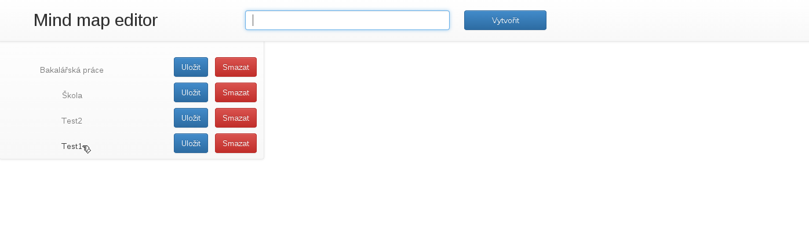
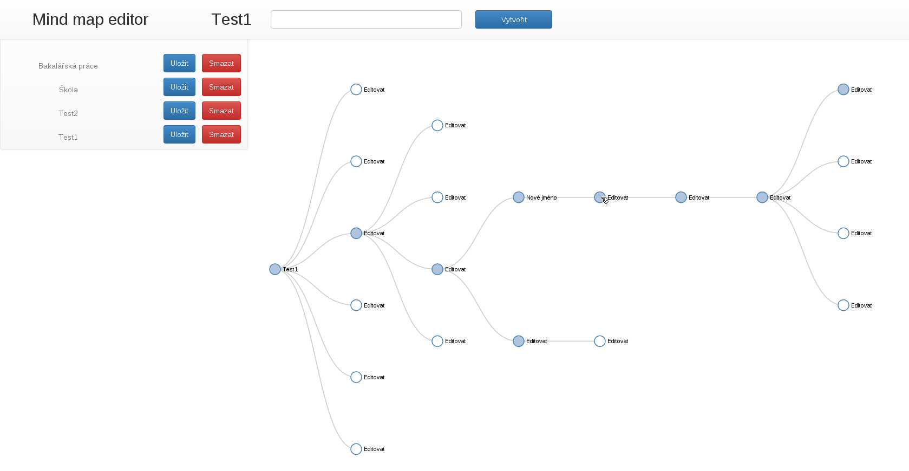
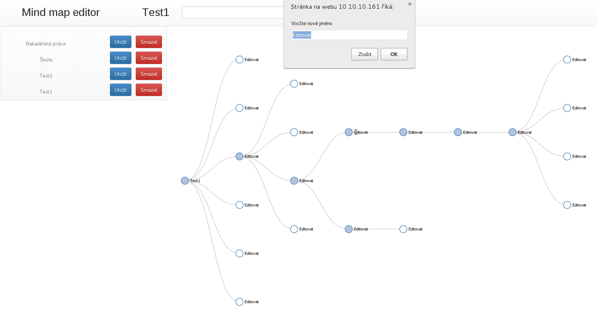

# MindMap editor

implementation of d3.js tree layout mind map editor

* [Vert.x](http://vertx.io/)
* [Mongodb](http://www.mongodb.org/)
* [d3.js](http://d3js.org/)

## Run server all in one app

`vertx runmod io.majklk~mindmapeditor~0.0.1 -conf example/allinone.json`

## Run in cluster

### Node 1 - HTTP + WebSocket

`vertx runmod io.majklk~mindmapeditor~0.0.1 -cluster-host interface -ha -conf example/webserver.json`

### Node 2 - Database Node + Shell access + Image exporter

`vertx runmod io.majklk~mindmapeditor~0.0.1 -cluster-host interface -ha -conf example/dbserver.json`

## SSH access to vert.x core over Node 2

`ssh -p 2000 admin@ip_node2`

## Screenshots

